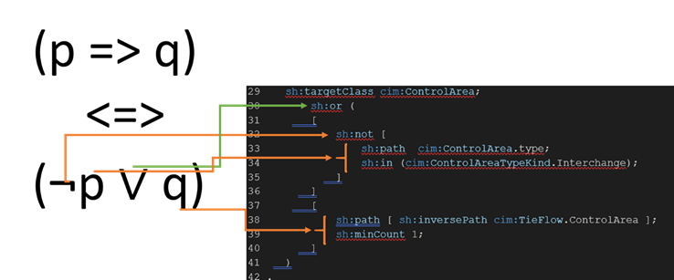

# cgmes-modeling-shacl
Modeling CGMES rules using RDF/OWL/SHACL


## Scope:
```
The authors have modeled/implemented all CGMES rules.
In this introduction, the authors have addressed only level 3 (QoCDC 3.2; CGMES 2.4.15) for pedagogical reasons.
For any question contact us: cimcgmes@gmail.com 
Any kind of feedback is welcome.
```
>**For more information about our research, visit our [Publication in IEEE](https://ieeexplore.ieee.org/abstract/document/9205800).**

## Introduction:
```
SHACL is a W3C standard for the validation of RDF models against conditions or restrictions. 
The specification of this standard is in the following link of the w3c https://www.w3.org/TR/shacl/.
```
#### Set up the application:
```
Download cgmesvalidation.zip. 
  
Unzip the downloaded file, for example, in the C:\cgmesvalidation folder.

Type the command as follows:

C:\cgmesvalidation> java -jar cgmesrules.jar

It should appear the following output.
```
```
-----------------------
Select an option:<br>
1: Validate CGMES rules:
2: Exit<br>
-----------------------
Op:
```
#### Developing a CGMES rule example:
```
Download CGMES Test from https://www.entsoe.eu/Documents/CIM_documents/Grid_Model_CIM/TestConfigurations_packageCASv2.0.zip.
Unzip TestConfigurations_packageCASv2.0.zip
Inside the SmallGrid folder, open the BusBranch folder and unzip CGMES_v2.4.15_SmallGridTestConfiguration_BaseCase_Complete_v3.0.0.zip, where the SmallGridTestConfiguration_BC_EQ_v3.0.0.xml file can be retrieved.>

rule.ttl is the file where is modeled CATieFlow rule, specified from “QUALITY OF CGMES DATASETS AND CALCULATIONS FOR SYSTEM OPERATIONS 3.2 EDITION”:

Rule: 	CATieFlow 
Level: 	3 
Severity: ERROR Template: RuleObject 
Details: For every instance of cim:ControlArea for which the value of  cim:ControlArea.type is cim:ControlAreaTypeKind.Interchange,  cim:TieFlow instances must be provided.   
Justification:   This is necessary to compute interchange.   
Message:  cim:TieFlows must be defined for cim:ControlArea, no cim:TieFlows found
```
```
SHACL definition of the rule is depicted in the file rule.ttl and is as follows:


01: @base <http://iec.ch/TC57/2013/CIM-schema-cim16#> .
02: @prefix sh: <http://www.w3.org/ns/shacl#> .
03: @prefix rdf: <http://www.w3.org/1999/02/22-rdf-syntax-ns#> .
04: @prefix owl: <http://www.w3.org/2002/07/owl#> .
05: @prefix cim: <http://iec.ch/TC57/2013/CIM-schema-cim16#> .
06: @prefix xsd: <http://www.w3.org/2001/XMLSchema#> .
07: @prefix qodc: <http://entsoe.eu/CGMES2_4_15/QoCDC/3/0#> .
08: @prefix rdfs: <http://www.w3.org/2000/01/rdf-schema#> .
09: @prefix entsoe: <http://entsoe.eu/CIM/SchemaExtension/3/1#> .
10: @prefix ccs: <http://entsoe.eu/CIM/iso31661Code/schema#> .
11: @prefix cc: <http://entsoe.eu/CIM/iso31661Code/codes#> .
12: @prefix cims: <http://iec.ch/TC57/1999/rdf-schema-extensions-19990926#> .
13: @prefix md: <http://iec.ch/TC57/61970-552/ModelDescription/1#> .
14: 
15: 
16: #   Rule: 
17: #       CATieFlow 
18: #   Level: 
19: #       3 
20: #   Severity: 
21: #       ERROR Template: RuleObject 
22: #   Details: 
23: #       For every instance of cim:ControlArea for which the value of  cim:ControlArea.type is  
24: #       cim:ControlAreaTypeKind.Interchange,  cim:TieFlow instances must be provided.   Justification:   This is necessary to 
25: #       compute interchange.   
26: #   Message:  
27: #       cim:TieFlows must be defined for cim:ControlArea, no cim:TieFlows found
28: 
29: 
30: qodc:CATieFlow a sh:PropertyShape;
31:     sh:message "cim:TieFlows must be defined for cim:ControlArea, no cim:TieFlows found";
32:     sh:severity qodc:ERROR;
33:     sh:targetClass cim:ControlArea;
34:         sh:or (
35:         [
36:             sh:not [
37:                 sh:path  cim:ControlArea.type;
38:                 sh:in (cim:ControlAreaTypeKind.Interchange);
39:             ]
40:         ]
41:         [
42:             sh:path [ sh:inversePath cim:TieFlow.ControlArea ];
43:             sh:minCount 1;
44:         ]
45:     )
46: .
```

```
From line 1 to line 13, needed prefixes are declared.
From line 16 to line 27, the CGMES rule is described.
Line 30 qodc:CATieFlow a sh:PropertyShape; declares a shape named qodc:CATieFlow which is of type sh:PropertyShape.
Line 31 sh:message "cim:TieFlows must be defined for cim:ControlArea, no cim:TieFlows found";
Declares the message that will be shown when the rule is violated.
Line 32 sh:severity qodc:ERROR; severity is declared.
Line 33 sh:targetClass cim:ControlArea; specify the target class for the shape. It represents the objects that act as focus nodes for the SHACL processor.
```
```
The text rule is as follows: 
23: #       For every instance of cim:ControlArea for which the value of  cim:ControlArea.type is  
24: #       cim:ControlAreaTypeKind.Interchange,  cim:TieFlow instances must be provided.   Justification:   This is necessary to 
25: #       compute interchange.   
```
```
A Boolean expression that corresponds to the rule described above, can be defined as follows:
∀ca ∈ cim:ControlArea (( ca cim:controlArea.type cim:controlAreaTypeKind.Interchange) => (∃ tf  ∈ cim:TieFlow | tf cim:TieFlow.ControlArea ca))
It is an implication statement [p => q].
SHACL grammar does not support the implication construct, however  (p => q) <=> (¬p ∨ q)
Therefore, the Boolean expression is written as follows:
∀c ∈ cim:ControlArea  (¬ ( ca cim:controlArea.type cim:controlAreaTypeKind.Interchange) ∨ (∃ tf  ∈ cim:TieFlow | tf cim:TieFlow.ControlArea ca))
Its corresponding definition in SHACL is as follows:

```


#### Executing the validation process:

```
Type the following command to run the application.
java -jar cgmesrules.jar
--------------------------------
Select an option:
1: Validate CGMES rules:
2: Exit
--------------------------------
Op: 1
---------------------------------------
Validating CGMES rules:
---------------------------------------
Enter the path of data model:
SmallGridTestConfiguration_BC_EQ_v3.0.0.xml
Enter the path of SHACL rules:
rule.ttl
Validating \
-----------------------
Validation report:
-----------------------
01: @prefix entsoe: <http://entsoe.eu/CIM/SchemaExtension/3/1#> .
02: @prefix cc:    <http://entsoe.eu/CIM/iso31661Code/codes#> .
03: @prefix cims:  <http://iec.ch/TC57/1999/rdf-schema-extensions-19990926#> .
04: @prefix owl:   <http://www.w3.org/2002/07/owl#> .
05: @prefix cim:   <http://iec.ch/TC57/2013/CIM-schema-cim16#> .
06: @prefix xsd:   <http://www.w3.org/2001/XMLSchema#> .
07: @prefix qodc:  <http://entsoe.eu/CGMES2_4_15/QoCDC/3/0#> .
08: @prefix dm:    <http://iec.ch/TC57/61970-552/DifferenceModel/1#> .
09: @prefix rdfs:  <http://www.w3.org/2000/01/rdf-schema#> .
10: @prefix ccs:   <http://entsoe.eu/CIM/iso31661Code/schema#> .
11: @prefix rdf:   <http://www.w3.org/1999/02/22-rdf-syntax-ns#> .
12: @prefix sh:    <http://www.w3.org/ns/shacl#> .
13: @prefix md:    <http://iec.ch/TC57/61970-552/ModelDescription/1#> .
14: 
15: [ a            sh:ValidationReport ;
16:   sh:conforms  false ;
17:   sh:result    [ a                             sh:ValidationResult ;
18:                  sh:focusNode                  <urn:uuid:1f9ecd81-e069-4040-bd64-f34b0fac3a60> ;
19:                  sh:resultMessage              "cim:TieFlows must be defined for cim:ControlArea, no cim:TieFlows found" ;
20:                  sh:resultSeverity             qodc:ERROR ;
21:                  sh:sourceConstraintComponent  sh:OrConstraintComponent ;
22:                  sh:sourceShape                qodc:CATieFlow ;
23:                  sh:value                      <urn:uuid:1f9ecd81-e069-4040-bd64-f34b0fac3a60>
24:                ]
25: ] .


Line 1 to line 13, prefixes are declared.
Line 15  a sh:ValidationReport; declares a blank node of type sh:ValidationReport which represents the validation report.
Line 16  sh:conforms  false; indicates the conformity of the rules for the model.
Line 18 sh:focusNode    <urn:uuid:1f9ecd81-e069-4040-bd64-f34b0fac3a60> ; indicates the node where the rule is violated.
Line 19 sh:resultMessage      "cim:TieFlows must be defined for cim:ControlArea, no cim:TieFlows found" ; shows the feedback of the violation.
Line 22 sh:sourceShape    qodc:CATieFlow ; indicates the rule id that was violated.
```
#### Modifiying the model to be compliant:

```
If the following RDF/XML code is added to the model file, the model will be compliant with the rule.
(Note: the code could be added at the end of the file before the last tag)
  <cim:TieFlow rdf:about="urn:uuid:b41a1687-9401-36ba-caa3-201f29dad134">
    <cim:TieFlow.positiveFlowIn>true</cim:TieFlow.positiveFlowIn>
    <cim:TieFlow.ControlArea rdf:resource="urn:uuid:1f9ecd81-e069-4040-bd64-f34b0fac3a60" />
    <cim:TieFlow.Terminal rdf:resource="urn:uuid:97f0304c-e6b1-0273-4b81-89274c11b4f8" />
  </cim:TieFlow>

  <cim:ControlArea rdf:ID="_1f9ecd81-e069-4040-bd64-f34b0fac3a60">
    <cim:IdentifiedObject.name>_CA_GB</cim:IdentifiedObject.name>
    <cim:ControlArea.type rdf:resource="http://iec.ch/TC57/2013/CIM-schema-cim16#ControlAreaTypeKind.Interchange" />
  </cim:ControlArea>

And validate the model once again selecting the option 1 from the menu.
-----------------------
Select an option:
1: Validate CGMES rules:
2: Exit
-----------------------
Op: 1
-----------------------
Validating CGMES rules:
-----------------------
Enter the path of data model:
SmallGridTestConfiguration_BC_EQ_v3.0.0.xml
Enter the path of SHACL rules:
rule.ttl
 Validating /
-----------------------
Validation report:
-----------------------
@prefix entsoe: <http://entsoe.eu/CIM/SchemaExtension/3/1#> .
@prefix cc:    <http://entsoe.eu/CIM/iso31661Code/codes#> .
@prefix cims:  <http://iec.ch/TC57/1999/rdf-schema-extensions-19990926#> .
@prefix owl:   <http://www.w3.org/2002/07/owl#> .
@prefix cim:   <http://iec.ch/TC57/2013/CIM-schema-cim16#> .
@prefix xsd:   <http://www.w3.org/2001/XMLSchema#> .
@prefix qodc:  <http://entsoe.eu/CGMES2_4_15/QoCDC/3/0#> .
@prefix dm:    <http://iec.ch/TC57/61970-552/DifferenceModel/1#> .
@prefix rdfs:  <http://www.w3.org/2000/01/rdf-schema#> .
@prefix ccs:   <http://entsoe.eu/CIM/iso31661Code/schema#> .
@prefix rdf:   <http://www.w3.org/1999/02/22-rdf-syntax-ns#> .
@prefix sh:    <http://www.w3.org/ns/shacl#> .
@prefix md:    <http://iec.ch/TC57/61970-552/ModelDescription/1#> .

[ a            sh:ValidationReport ;
  sh:conforms  true
] .

The above validation report shows that the model is compliant with the rule. [sh:conforms  true]
```


```
For more detailed explanation about this topic do not hesitate contact us: cimcgmes@gmail.com 
```
